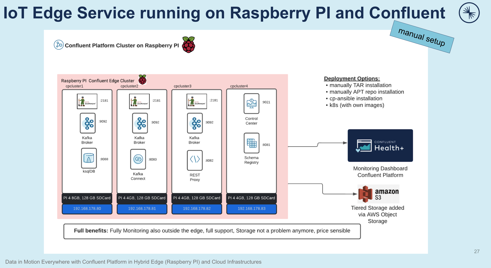

# Confluent Platform on Raspberry PI

This github repo shows how to build a Raspberry PI cluster with Confluent Platform. The cluster is around ~250€ with ~10-15MB/s throughput and half, if you enable all features like Admin API, cp-server. Confluent Platform is so to say made for RPI. With best feature set like tiered storage and others you can really have a cheap IoT edge cluster. Confluent is closing the gap between offline and online.

Manual installation setup and architecture is shown in following image.

Automatic installation setup with cp-ansible and architecture is shown in following image.

The benefits to run Confluent Platform on Raspberry PI are obviously:
* full and complete Monitoring with Confluent Control Center in Management Mode and Health+ for the Monitoring Dashboard outside the edge. The Monitoring Dashboard has drill-down functionality and intelligente alert will inform you automatically
* SDCard Storage with no disks are not an issue on RPI anymore if Tiered Storage and integration of Cloud provider Object Storage (in our case AWS S3) is enabled
* clsoing the cagp between offline and online situations
* Full support of the complete Confluent Edge platform
* Adjusted project prices for Edge Subscriptions

Currently, we know 4 deployment options to deploy Confluent Platform on Raspberry PI:
* complete manual [deployment with TAR installation](tar-ball-installation/) - **covered here**
* Automatic deployment via [cp-ansible](cp-ansible-installation/) - **covered here**
* complete manual deployment with some automatism (service setup etc.) with confluent packages via OS apt-get/yum repository, please follow the [documentation](https://docs.confluent.io/platform/current/installation/installing_cp/overview.html).  - **not covered here**
* k8s deployment with Confluent for Kubernetes and own container images. Confluent do not offer ARM images right now. You have to build the container images by yourself, see [documentation](https://docs.confluent.io/platform/current/installation/docker/development.html).  - **not covered here**
   * A partner of Confluent is having a complete package including HW, SW and own build k8s container images. Please visit [HiveCell: Edge PaaS for Kafka](https://hivecell.com/service/)

# Use cases for such a low cost cluster
During the presentation of this Lab we do name a lot of use cases, please find here the main use cases:
* IoT edge clusters: is queuing events in location where having requirement to do that (e.g. not having all time a working network, or having no IT) e.g.
  * on cruises
  * local shops
  * energy parks like Photovoltaic
* remote maintenance for expensive machines

# Software
we will use the following software to run the cluster on Raspberry PIs
* Ubuntu OS
* openJDK: Java 11
* Python 3
* Confluent Platform 7.1
* Confluent cli

# Hardware
We will run with Raspberry PI 4B. Best would be with 8 GB RAM, but this is not easy to get today. 4GB RAM do work also quite good. I did add a buying list with links to Amazon, but please keep in mind that Amazon is selling RPI with very expensive prices, my choice of buying RPI is [berrybase](https://www.berrybase.de/). They run the same prices like before Corona:
* 4 x [Raspberry PI 4 4GB RAM](https://amzn.to/3FwZHX0) or [Raspberry PI 4 8GB RAM](https://amzn.to/3L47MDK) (Raspberry )
    * 1 x [RPI cluster buildcase](https://amzn.to/3vUVCbE)
* 1 x [USB Power Hub](https://amzn.to/3LZDmUm)
    * 4 x [USB-C Power cable](https://amzn.to/3FHU6xb)
* 1 x [unmanaged Network Router](https://amzn.to/3vUyha8)
    * 1 x [Network cable](https://amzn.to/399lb00)
* 4 x [128 GB SDCard](https://amzn.to/3wgqBhy)
* 1 x [LED light band](https://amzn.to/3Ftp6AI)
* 1 x [Power Cable](https://amzn.to/3smIaLE)

# Note/license:
***Note***: Confluent Platform is a subscription based software product and has to be licensed. You will get for the first 30 days an evaluation license without any charges.