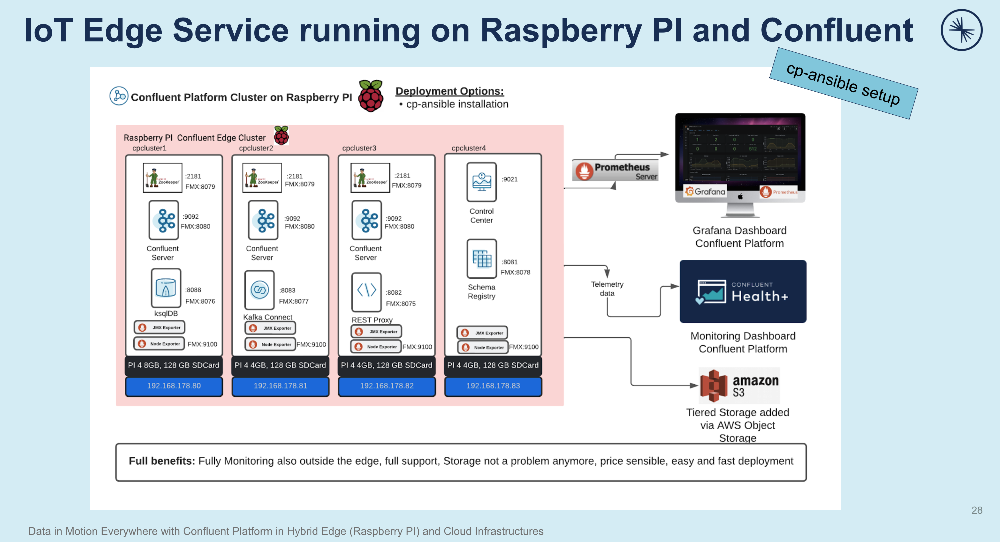
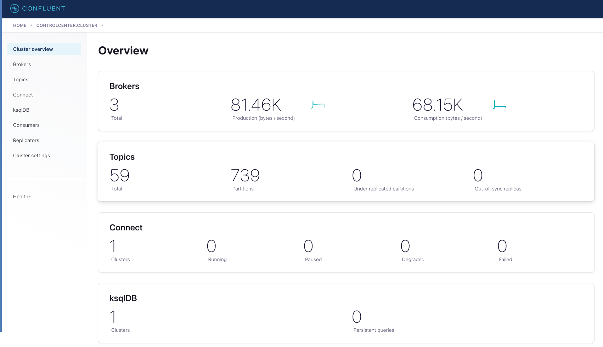
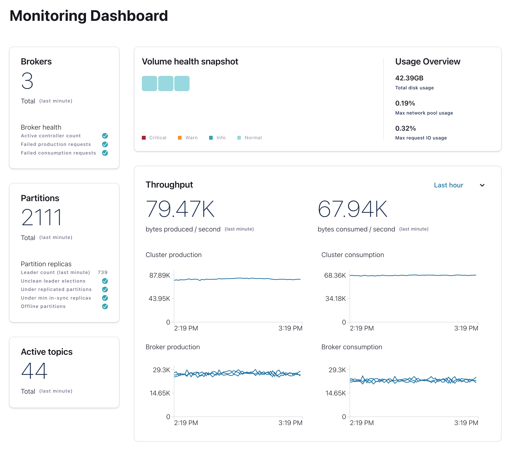
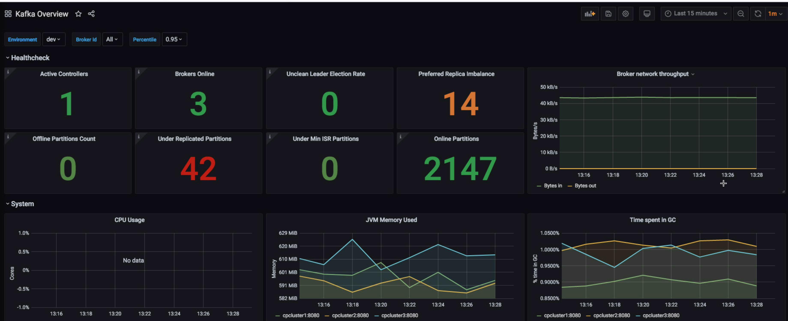
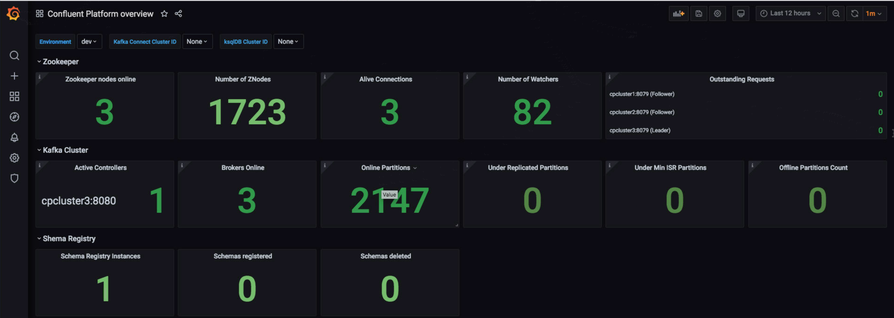
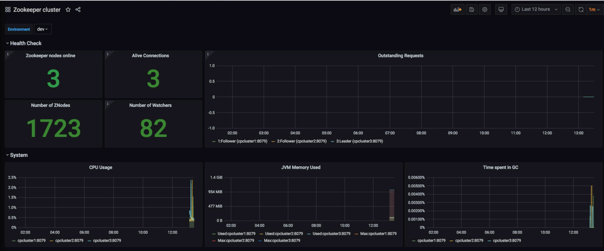
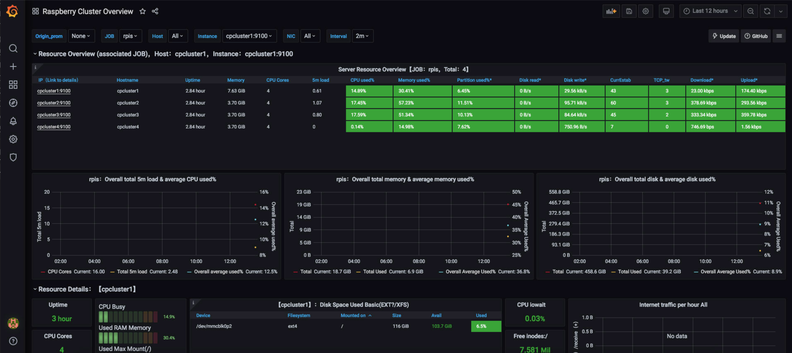

# Confluent Platform Installation on Raspberry PI via cp-ansible

The main goal is running a Raspberry PI 4 Node cluster with a Confluent Platform deployment.
Installation setup is shown in following image.


## SSH Key setup
In this lab, we are working with cp-ansible. It is easier to run ssh with keys, so that we do create first a public key pair on our Mac.
I do create first a private public key pair. For this you need openSSH Client. Check for your OS how to install it.
Create the keys:
```bash
ssh-keygen -t rsa -b 4096
# No passphrase
# Give it a name in my case rpi-key
```
You will get two keys:
1. rpi-key: this is private key, this key have to stay safe on your desktop
2. rpi-key.pub: this is the public key. You need to copy the complete content of this file into `.ssh/auhtorized_keys` on your RPI Node.
Then we can do ssh login without password `ssh -i rpi-key ubuntu@cpcluster1`
## Raspberry preparation for each Node
Note: Before we are starting please format with SD Formatter SDCard image. If it is a new SDCard you are safe. By the way I am using the Raspberry PI Imager in the Version 1.6.2 on my Mac. There are also other apps out there. I did also use balenaEtcher in former times.

Please follow the installation and configuration process for each node:
* [cpcluster1 Node deployment](ReadmeCPCLUSTER1.md)
* [cpcluster2 Node deployment](ReadmeCPCLUSTER2.md)
* [cpcluster3 Node deployment](ReadmeCPCLUSTER3.md)
* [cpcluster4 Node deployment](ReadmeCPCLUSTER4.md)

## do cp-ansible setup
My first thinking was to use [Confluent Ansible installer](https://www.confluent.io/installer) but the outcome would be too generic for us. We need a more special setup, because we are doing co-location. In our case we are running up to 3 Confluent Platform components on one node. If you wan't have co-location, of course the cluster would be faster and it is fit more into Confluent best practice for production deployments.
That's why I developed my own investory file. Please see [host.yml](host.yml) here in our repo. You need to add your own credentials for AWS and Health+. And if you have a license key, add this key as well.

If you need more input regarding cp-ansible and configuration start here 
* [sample host.yml](https://github.com/confluentinc/cp-ansible/blob/7.1.1-post/docs/hosts_example.yml)
* [Variables description](https://github.com/confluentinc/cp-ansible/blob/7.1.1-post/docs/VARIABLES.md)
* [dcoumentation](https://docs.confluent.io/ansible/current/overview.html)
### Steps to run cp-ansible
Please follow the pre-reqs of Confluent Ansible Installer for your Desktop. We do need some tools on our Desktop: ssh, ansible, git, python (v3.x) should be installed on your desktop (I use MacOS). cp-ansible will be executed via ansible from our Desktop. Ansible is a Python program and will do the complete installation and setup. 
THIS IS REALLY PRETTY COOL (-:). Configure you setup in hosts.yml and then cp-ansible do the rest for you.
First, install cp-ansible packages
```bash
ansible-galaxy collection install git+https://github.com/confluentinc/cp-ansible.git
```
Second, Run cp-ansible installation for our RPI cluster based on our configuration in `hosts.yml`. Please do not forget the adapt it to your environment.
```bash
ansible-playbook -i hosts.yml confluent.platform.all
# with Debug information run the next command, if you need this for error tracking
#ansible-playbook -vvv -i hosts.yml confluent.platform.all > failure.txt
```
The outcome should look like this
```bash
PLAY RECAP *********************************************************************
cpcluster1                 : ok=84   changed=5    unreachable=0    failed=0    skipped=80   rescued=0    ignored=0   
cpcluster2                 : ok=83   changed=5    unreachable=0    failed=0    skipped=74   rescued=0    ignored=0   
cpcluster3                 : ok=79   changed=2    unreachable=0    failed=0    skipped=69   rescued=0    ignored=0   
cpcluster4                 : ok=53   changed=3    unreachable=0    failed=0    skipped=50   rescued=0    ignored=0   
```
The good news:**WE ARE FINISHED!**
As you can see, installing Confluent Platform with cp-ansible is really straight forward. The preparation is small, and all the complex stuff is done by cp-ansible including setup fmx_exporter.

**You can follow cp-ansible more in detail here:**
* [Documentation](https://docs.confluent.io/ansible/current/overview.html)
* [github](https://github.com/confluentinc/cp-ansible): By the way if you have some issues and want to improve something or you miss something, you can of course create an issue or PR in github. This is the fastest way to discuss with cp-ansible developers.

#### Check installation and setup
To become familiar with the cluster we do check the installation manually.
Login into the node via `ssh -i rpi-key ubuntu@cpcluster1-4`
To become root you can do this `sudo -s`
Logs are here `/var/log/kafka` or `/var/logs/confluent`
All running systemD services are listed via `sudo systemctl list-units --type=service`
The Confluent Platform is running these Services om Raspberry PI
* Status check:
  * cpcluster1: `sudo systemctl status confluent-zookeeper`
  * cpcluster1: `sudo systemctl status confluent-server`
  * cpcluster1: `sudo systemctl status confluent-ksqldb`
  * cpcluster2: `sudo systemctl status confluent-zookeeper`
  * cpcluster2: `sudo systemctl status confluent-server`
  * cpcluster2: `sudo systemctl status confluent-kafka-connect`
  * cpcluster3: `sudo systemctl status confluent-zookeeper`
  * cpcluster3: `sudo systemctl status confluent-server`
  * cpcluster3: `sudo systemctl status confluent-kafka-rest`
  * cpcluster4: `sudo systemctl status confluent-control-center`
  * cpcluster4: `sudo systemctl status confluent-schema-registry` 

You can also check the service definition file like this one for ksqlDB `sudo vi /etc/systemd/system/confluent-ksqldb.service.d/override.conf`

Confluent binaries are here: `/opt/confluent/confluent-7.1.1/bin/`

Properties file are found here `/opt/confluent/etc`

Logs are in /var/log/kafka or var/logs/confluent

#### Start each systemD manually
All Confluent systemD services are enabled and will start automatically after boot. But anyway, sometimes you have to check status, restart the services. Here is the list of starts in order for the complete cluster. You can also use the commands `status|restart|stop`
* cpcluster1: `sudo systemctl start confluent-zookeeper`
* cpcluster2: `sudo systemctl start confluent-zookeeper`
* cpcluster3: `sudo systemctl start confluent-zookeeper`
* cpcluster1: `sudo systemctl start confluent-server`
* cpcluster2: `sudo systemctl start confluent-server`
* cpcluster3: `sudo systemctl start confluent-server`
* cpcluster4: `sudo systemctl start confluent-schema-registry` 
* cpcluster3: `sudo systemctl start confluent-kafka-rest`
* cpcluster2: `sudo systemctl start confluent-kafka-connect`
* cpcluster1: `sudo systemctl start confluent-ksqldb`
* cpcluster4: `sudo systemctl start confluent-control-center`

#### check the component accessability
A quick check, if everything is working as expected could be:
```bash
# printout overview of cluster, if kafkacat is not installed, install it please https://docs.confluent.io/platform/current/app-development/kafkacat-usage.html
kcat -b cpcluster1:9092,cpcluster2:9092,cpcluster3:9092 -L
# check If port are reachable
nc -vz cpcluster1 9092
nc -vz cpcluster1 2181
nc -vz cpcluster1 8079
nc -vz cpcluster1 8080
nc -vz cpcluster1 8076
nc -vz cpcluster2 9092
nc -vz cpcluster2 2181
nc -vz cpcluster2 8079
nc -vz cpcluster2 8080
nc -vz cpcluster2 8077
nc -vz cpcluster2 8076
nc -vz cpcluster3 9092
nc -vz cpcluster3 2181
nc -vz cpcluster3 8079
nc -vz cpcluster3 8080
nc -vz cpcluster3 8075
nc -vz cpcluster4 8078
nc -vz cpcluster4 9021
nc -vz cpcluster1 8090
nc -vz cpcluster2 8090
nc -vz cpcluster3 8090
# show topics
kafka-topics --bootstrap-server cpcluster1:9092,cpcluster2:9092,cpcluster3:9092 -list
# create topic
kafka-topics --bootstrap-server cpcluster1:9092,cpcluster2:9092,cpcluster3:9092 --create --replication-factor 1 --partitions 1 --topic test
kafka-topics --bootstrap-server cpcluster1:9092,cpcluster2:9092,cpcluster3:9092 --create --replication-factor 3 --partitions 3 --topic testreplica
# check schema registry
curl http://192.168.178.83:8081
# check connect
curl http://192.168.178.81:8083
# check ksqldb
curl http://192.168.178.80:8088/info
# check REST
curl http://192.168.178.82:8082
# control center or open URL in Browser
curl http://192.168.178.83:9021

# check admin API of cp-server
curl --silent -X GET http://192.168.178.80:8090/kafka/v3/clusters/ | jq

# Check prometheus
# Check prometheus agent on cpcluster1, should be all clusters
ssh -i rpi-key ubuntu@cpcluster1
# check the ports for fmx_exporter Agent
ps -ef | grep kafka.Kafka | grep javaagent
#Output: ...jmx_prometheus_javaagent.jar=8080...
#check endpoint Zookeeper metrics
curl http://cpcluster1:8079/metrics
#check endpoint Broker  metrics
curl http://cpcluster1:8080/metrics
#check endpoint ksqlDB  metrics
curl http://cpcluster1:8076/metrics
#check endpoint Zookeeper metrics
curl http://cpcluster2:8079/metrics
#check endpoint Broker  metrics
curl http://cpcluster2:8080/metrics
#check endpoint connect  metrics
curl http://cpcluster2:8077/metrics
#check endpoint Zookeeper metrics
curl http://cpcluster3:8079/metrics
#check endpoint Broker  metrics
curl http://cpcluster3:8080/metrics
#check endpoint Rest Proxy metrics
curl http://cpcluster3:8075/metrics
#check endpoint Schema Registry metrics
curl http://cpcluster3:8078/metrics
```
The Confluent Control Center is running in management mode, because I do activate the Health+. The big and fat Kstreams Client is not running, that keeps our installation footprint small.

Health+ is really an impressive feature. Subscribe to intelligent alerts and you will be informed automatically if your RPI cluster is in bad situation.
The monitoring Dashboard for the RPI cluster in Confluent Cloud looks like the next graphic if you activate Health+. Here you will find anything you need aorund the Confluent Platform.


The need for Health+ is really interesting for IoT use case:
* Decentral Monitoring dashboard for 2nd level support, without the need of accessing the Confluent Platform cluster
* automatic Alerting when something goes wrong
* keep the footprint on the RPI cluster small (we run Control Center in management mode, so big fast KStreams part is not part of your cluster setup anymore)

## Monitoring with Grafana and Prometheus
Our cluster should work as expected. We did enable jmx_exporter in cp-ansible `hosts.yml`.
FMX Ports are configured by cp-ansible and jmx_exporter Agent from Prometheus with the property file for the CP components was installed on each node by cp-ansible. This was done by enabling this property `jmxexporter_enabled: true` in hosts.yml . So, we are almost fininished to add our Raspberry PI Cluster with Confluent Platform into Prometheus/Grafana deployment.
* In `hosts.yml` I have enabled prometheus jmxexporter
* cp-ansible will then setup everything for prometheus. 
* Without cp-ansible the setup would be much more complex. Please follow this [blog post](https://www.confluent.io/blog/monitor-kafka-clusters-with-prometheus-grafana-and-confluent/).
If you need more input around FMX OPT of JVM instances, see [here](https://docs.confluent.io/platform/current/installation/docker/operations/monitoring.html) and check the `hosts.yml`.
The configuaration file for prometheus [prometheus.yml](prometheus.yml) is stored here in this repo. You need to copy this file to your prometheus host. In my case I use my old iMac from 2011.

### Add node_exporter to the RPI Nodes
I did decide that we do need a Node Monitoring of the Raspberry PI. So, the main objective of running prometheus/grafana is to have a monitoring solution for RPI cluster OS/HW, because this kind of monitoring is not covered by Control Center nore Monitoring Dashboard (Health+). Please follow more detailed information around this ith next link list
* Prometheus Node_exporter, How to install](https://linuxhit.com/prometheus-node-exporter-on-raspberry-pi-how-to-install/)
* Grafana Dashboards for [Nodes](https://grafana.com/grafana/dashboards/1860)
* and a [github project](https://github.com/bhemar/raspberry-metrics) explaining RPI monitoring

Anyway, we will now enable node_exporter and import a Grafana Dashboard. We need to install this manually on all nodes of our cluster
#### CPCLUSTER1
enable node_exporter on cpcluster1
```Bash
ssh -i ~/keys/rpi-key ubuntu@cpcluster1
wget https://github.com/prometheus/node_exporter/releases/download/v1.3.1/node_exporter-1.3.1.linux-arm64.tar.gz
tar xvf node_exporter-1.3.1.linux-arm64.tar.gz
sudo mv node_exporter-1.3.1.linux-arm64/node_exporter /usr/local/bin 
rm node_exporter-1.3.1.linux-arm64.tar.gz
rm -rf node_exporter-1.3.1.linux-arm64/
sudo useradd -rs /bin/false node_exporter
# set up systemD
sudo vi /etc/systemd/system/node_exporter.service
[Unit]
Description=Node Exporter
After=network.target

[Service]
User=node_exporter
Group=node_exporter
Type=simple
ExecStart=/usr/local/bin/node_exporter

[Install]
WantedBy=multi-user.target

# Save file
sudo systemctl daemon-reload 
sudo systemctl enable node_exporter.service
sudo systemctl start node_exporter.service
sudo systemctl status node_exporter.service
# check metrics
curl http://cpcluster1:9100/metrics
```
#### CPCLUSTER2
enable node_exporter on cpcluster2
```Bash
ssh -i ~/keys/rpi-key ubuntu@cpcluster2
wget https://github.com/prometheus/node_exporter/releases/download/v1.3.1/node_exporter-1.3.1.linux-arm64.tar.gz
tar xvf node_exporter-1.3.1.linux-arm64.tar.gz
sudo mv node_exporter-1.3.1.linux-arm64/node_exporter /usr/local/bin 
rm node_exporter-1.3.1.linux-arm64.tar.gz
rm -rf node_exporter-1.3.1.linux-arm64/
sudo useradd -rs /bin/false node_exporter
# set up systemD
sudo vi /etc/systemd/system/node_exporter.service
[Unit]
Description=Node Exporter
After=network.target

[Service]
User=node_exporter
Group=node_exporter
Type=simple
ExecStart=/usr/local/bin/node_exporter

[Install]
WantedBy=multi-user.target

# Save file
sudo systemctl daemon-reload 
sudo systemctl enable node_exporter.service
sudo systemctl start node_exporter.service
sudo systemctl status node_exporter.service
# check metrics
curl http://cpcluster2:9100/metrics
```
#### CPCLUSTER3
enable node_exporter on cpcluster3
```Bash
ssh -i ~/keys/rpi-key ubuntu@cpcluster3
wget https://github.com/prometheus/node_exporter/releases/download/v1.3.1/node_exporter-1.3.1.linux-arm64.tar.gz
tar xvf node_exporter-1.3.1.linux-arm64.tar.gz
sudo mv node_exporter-1.3.1.linux-arm64/node_exporter /usr/local/bin 
rm node_exporter-1.3.1.linux-arm64.tar.gz
rm -rf node_exporter-1.3.1.linux-arm64/
sudo useradd -rs /bin/false node_exporter
# set up systemD
sudo vi /etc/systemd/system/node_exporter.service
[Unit]
Description=Node Exporter
After=network.target

[Service]
User=node_exporter
Group=node_exporter
Type=simple
ExecStart=/usr/local/bin/node_exporter

[Install]
WantedBy=multi-user.target

# Save file
sudo systemctl daemon-reload 
sudo systemctl enable node_exporter.service
sudo systemctl start node_exporter.service
sudo systemctl status node_exporter.service
# check metrics
curl http://cpcluster3:9100/metrics
```
#### CPCLUSTER4
enable node_exporter on cpcluster4
```Bash
ssh -i ~/keys/rpi-key ubuntu@cpcluster4
wget https://github.com/prometheus/node_exporter/releases/download/v1.3.1/node_exporter-1.3.1.linux-arm64.tar.gz
tar xvf node_exporter-1.3.1.linux-arm64.tar.gz
sudo mv node_exporter-1.3.1.linux-arm64/node_exporter /usr/local/bin 
rm node_exporter-1.3.1.linux-arm64.tar.gz
rm -rf node_exporter-1.3.1.linux-arm64/
sudo useradd -rs /bin/false node_exporter
# set up systemD
sudo vi /etc/systemd/system/node_exporter.service
[Unit]
Description=Node Exporter
After=network.target

[Service]
User=node_exporter
Group=node_exporter
Type=simple
ExecStart=/usr/local/bin/node_exporter

[Install]
WantedBy=multi-user.target

# Save file
sudo systemctl daemon-reload 
sudo systemctl enable node_exporter.service
sudo systemctl start node_exporter.service
sudo systemctl status node_exporter.service
# check metrics
curl http://cpcluster4:9100/metrics
```
### Complete setup of Grafana and Prometheus on my iMac
my iMac is a fresh macOS High Sierra installation. Before starting with Grafana/Prometheus we need to install some tools:
```bash
# install homebrew from command prompt 
/bin/bash -c "$(curl -fsSL https://raw.githubusercontent.com/Homebrew/install/HEAD/install.sh)"
brew help
# install wget
brew install wget

# Install Visual Source code for having a good coding tool
wget https://code.visualstudio.com/Download
# copy visual code into application dir manually

# install firefox from https://www.mozilla.org/en-US/firefox/mac/
# we do need firefox because Safari cannot work with prometheus UI

# Unfortunately Docker did not work anymore, I would need macOS 10.14, but have 10.13.6

# install python 3 on macOS, comes with Pythion 2.7
vi .bashrc
export PATH="/usr/local/opt/python/libexec/bin:$PATH"

brew install python
# should python 3
python --version
# will launch old version
python2
#will launch new version
python3

# install promethus and Grafana via brew did not work in my case
# Download package from here https://prometheus.io/download/
wget https://github.com/prometheus/prometheus/releases/download/v2.35.0/prometheus-2.35.0.darwin-amd64.tar.gz
tar xvf prometheus-2.35.0.darwin-amd64.tar.gz
rm prometheus-2.35.0.darwin-amd64.tar.gz
# Create prometheus as systemd later if you want
mkdir prom_data
mv prometheus-2.35.0.darwin-amd64/ prometheus/
cd prometheus/

# alert manager
wget https://github.com/prometheus/alertmanager/releases/download/v0.24.0/alertmanager-0.24.0.darwin-amd64.tar.gz
tar xvf alertmanager-0.24.0.darwin-amd64.tar.gz
cp alertmanager-0.24.0.darwin-amd64/* prometheus/
rm -rf alertmanager-0.24.0.darwin-amd64
rm alertmanager-0.24.0.darwin-amd64.tar.gz

# node_exporter
wget https://github.com/prometheus/node_exporter/releases/download/v1.3.1/node_exporter-1.3.1.darwin-amd64.tar.gz
tar xvf node_exporter-1.3.1.darwin-amd64.tar.gz
cp node_exporter-1.3.1.darwin-amd64/* prometheus/
rm -rf node_exporter-1.3.1.darwin-amd64
rm node_exporter-1.3.1.darwin-amd64.tar.gz

# copy prometheus.yml from github repo to /Users/admin/prometheus
cp promethus.yml /Users/admin/prometheus/

# Start prometheus, later you can build a service around this
/Users/admin/prometheus/prometheus \
 --config.file /Users/admin/prometheus/prometheus.yml \
 --storage.tsdb.path /Users/admin/prom_data \
 --web.console.templates=/Users/admin/prometheus/consoles \
 --web.console.libraries=/Users/admin/prometheus/console_libraries \
 --web.enable-lifecycle

# goto to UI and show if it is working
http://localhost:9090/graph
http://localhost:9090/metrics
http://localhost:9090/targets

# install Grafana
wget https://dl.grafana.com/oss/release/grafana-7.1.5.darwin-amd64.tar.gz
tar xvf grafana-7.1.5.darwin-amd64.tar.gz
mv grafana-7.1.5 grafana
rm grafana-7.1.5.darwin-amd64.tar.gz
cd /Users/admin/grafana/bin
# Start Grafana
./grafana-server web
```
Now, you need to configure Prometheus in Grafana as new datasource for prometheus with http://localhost:9090
I did prepare three Dashbaords, you can import them via Grafana UI Upload JSON.
You will find the Dashboards [here](https://github.com/ora0600/confluent-on-raspberrypi/tree/main/cp-ansible-installation/grafana-dashboard)
There are couple of Dashboards out there. If you need more, please google for it. Confluent did offer more [Dashboards for Grafana](https://github.com/confluentinc/jmx-monitoring-stacks/tree/6.1.0-post/jmxexporter-prometheus-grafana/assets/grafana/provisioning/dashboards)
Im my case I use three Dashboard. 2 Dashboard around Confluent Platform, and you will see, we do not need them because we do have Monitoring Dashboard from Health+. And a third one 
which show OS and HW Metrics of our cluster. This is quite useful:

Kafka Overview Dashboard

Confluent Platform Overview, not deployed in my Grafana

Zookeeper Cluster

Raspberry PI Cluster


My personally recommendation for everything around Confluent Platform is **use Monitoring Dashboard from Health+**. Here you can drill-down and have a complete view including alerting.
# Performance Test mit Kafka perftest tool
I did run the following perftest for a short check how much power our 250€ cluster has:
```bash
# create topic
cd script
kafka-topics --bootstrap-server 192.168.178.80:9092,192.168.178.81:9092, 192.168.178.82:9092 \
--create \
--topic perf-test-rep-three \
--partitions 6 \
--replication-factor 3 \
--command-config ./client.config

# describe topic
kafka-topics --bootstrap-server 192.168.178.80:9092,192.168.178.81:9092, 192.168.178.82:9092 \
--describe \
--topic perf-test-rep-three \
--command-config ./client.config

# run perf test
kafka-producer-perf-test \
--topic perf-test-rep-three \
--producer.config ./client.config \
--num-records 1000000 \
--throughput -1 \
--record-size 1000
```
The result is not too bad for such a small cluster, but less compared with manual setup (~10MB/s):
```bash
31521 records sent, 6304.2 records/sec (6.01 MB/sec), 2421.1 ms avg latency, 4183.0 ms max latency.
30752 records sent, 5813.2 records/sec (5.54 MB/sec), 3713.2 ms avg latency, 5357.0 ms max latency.
36512 records sent, 7302.4 records/sec (6.96 MB/sec), 6279.1 ms avg latency, 7233.0 ms max latency.
25440 records sent, 5065.7 records/sec (4.83 MB/sec), 3565.0 ms avg latency, 6185.0 ms max latency.
28288 records sent, 5647.4 records/sec (5.39 MB/sec), 7576.2 ms avg latency, 8572.0 ms max latency.
30016 records sent, 5320.1 records/sec (5.07 MB/sec), 4457.0 ms avg latency, 8453.0 ms max latency.
20928 records sent, 4183.9 records/sec (3.99 MB/sec), 8126.1 ms avg latency, 9609.0 ms max latency.
39808 records sent, 7659.8 records/sec (7.30 MB/sec), 5106.2 ms avg latency, 9560.0 ms max latency.
34144 records sent, 6828.8 records/sec (6.51 MB/sec), 5493.3 ms avg latency, 7441.0 ms max latency.
31936 records sent, 6387.2 records/sec (6.09 MB/sec), 4137.8 ms avg latency, 7186.0 ms max latency.
47232 records sent, 9442.6 records/sec (9.01 MB/sec), 4540.2 ms avg latency, 6485.0 ms max latency.
```
Do the same test with a tiered storage topic where the hot data stays for 1 minute on the broker `confluent.tier.local.hotset.ms=60000` and with a retention of 30 minutes `retention.ms=1800000` :
```bash
#Create topics with hotset
kafka-topics --bootstrap-server 192.168.178.80:9092,192.168.178.81:9092, 192.168.178.82:9092   \
--create --topic tieredstoragetopic \
--partitions 6 \
--replication-factor 3 \
--config confluent.tier.enable=true \
--config confluent.tier.local.hotset.ms=60000 \
--config retention.ms=1800000
# run perf test
# Depending which Version of Cp you are running or your desktop
export CLASSPATH=$CONFLUENT_HOME/share/java/monitoring-interceptors/monitoring-interceptors-7.0.1.jar
kafka-producer-perf-test \
--topic tieredstoragetopic \
--producer.config ./client.config \
--num-records 1000000 \
--throughput -1 \
--record-size 1000
```
The result is not too bad for such a small cluster, but less than manual setup (~10MB/s):
```bash
44865 records sent, 8942.6 records/sec (8.53 MB/sec), 1877.2 ms avg latency, 3661.0 ms max latency.
17504 records sent, 3296.4 records/sec (3.14 MB/sec), 3296.8 ms avg latency, 6470.0 ms max latency.
50656 records sent, 10131.2 records/sec (9.66 MB/sec), 5471.7 ms avg latency, 7376.0 ms max latency.
16416 records sent, 3281.2 records/sec (3.13 MB/sec), 4283.3 ms avg latency, 7622.0 ms max latency.
52640 records sent, 10521.7 records/sec (10.03 MB/sec), 4884.7 ms avg latency, 7572.0 ms max latency.
18848 records sent, 3765.8 records/sec (3.59 MB/sec), 5348.9 ms avg latency, 7472.0 ms max latency.
41888 records sent, 7464.0 records/sec (7.12 MB/sec), 4718.9 ms avg latency, 7590.0 ms max latency.
35264 records sent, 7051.4 records/sec (6.72 MB/sec), 5584.6 ms avg latency, 7396.0 ms max latency.
34848 records sent, 6965.4 records/sec (6.64 MB/sec), 3907.2 ms avg latency, 7440.0 ms max latency.
38272 records sent, 7651.3 records/sec (7.30 MB/sec), 5397.3 ms avg latency, 7818.0 ms max latency.
```
The performance is more or less the same. But with tiered storage we do need much disk space on the broker.
# Run producer and consumer to bring some load on the cluser
We do bring sdeom load on the cluster. Forst create an avro topic.
```bash
scripts/00_start_clients.sh
```
This script will start 2 terminal session (iterm) and produce and consume avro sample data.
# Start cluster
Start only CP components via `scripts/98_start_cpcluster.sh`
# Stop Cluster
First stop CP components  `./99_stop_cpcluster.sh`
then Stop Cluster `./99_shutdown_cluster.sh cpcluster1 cpcluster2 cpcluster3 cpcluster4`
# Clean Cluster
During play around with deployment etc. it is sometimes necessary to clean the cluster. For this I put a script into that repo. Start cleaning
```bash
scripts/99_clean_cpcluster.sh
```
After cleaning you can deploy Confluent Platform via cp-ansible and will have a fresh and clean installation:
```bash
ansible-playbook -i hosts.yml confluent.platform.all
```
# Hint: re-configure
I did make an error in connect setup in `hosts.yml`. I changed my error. And then I need to run a re-configure. This can be done via
```bash
# Run cp-ansible only for connect cluster
ansible-playbook -i hosts.yml confluent.platform.all   --tags kafka_connect
```
# Upgrade to verion 7.5.2 of Confluent Platform
This explained cluster here is running on CP 7.1.0.
To upgrade to 7.5.2 of Confluent Platform please follow this [guide](update2CP7.5.2.md)

[back](https://github.com/ora0600/confluent-on-raspberrypi)
