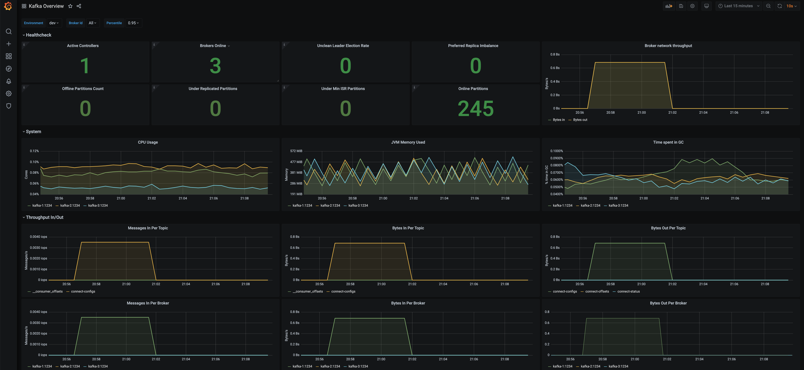

# Confluent Platform Installation on Raspberry PI via cp-ansible

The main goal is running a Raspberry PI 4 Node cluster with a Confluent Platform deployment.
Installation setup is shown in following image.


## SSH Key setup
Now, we are working with cp-ansible and it is easier to run ssh with keys, so that we do create first a public key pair on our Mac.
I do create first a private public key pair. For this you need openSSH Client. Check for your OS how to install it.
Create the keys:
```bash
ssh-keygen -t rsa -b 4096
# No passphrase
# Give it a name in my case rpi-key
```
Now, you will two keys:
1. rpi-key: this is private key, this key have to stay safe on your desktop
2. rpi-key.pub: this is the public key. You need to copy the complete content of this file into `.ssh/auhtorized_keys` on your RPI Node.
Then we can do ssk login without password `ssh -i rpi-key ubuntu@cpcluster1`
## Raspberry preparation for each Node
Note: Before we are starting please format with SD Formatter SDCard image. If it is a new SDCard you are safe. By the way I am Using the Raspberry PI Imager in the Version 1.6.2 on my Mac. There are also other apps out there. I did also use balenaEtcher in former times.

Please follow the installation and configuration process for each node:
* [cpcluster1 Node deployment](ReadmeCPCLUSTER1.md)
* [cpcluster2 Node deployment](ReadmeCPCLUSTER2.md)
* [cpcluster3 Node deployment](ReadmeCPCLUSTER3.md)
* [cpcluster4 Node deployment](ReadmeCPCLUSTER4.md)

## do cp-ansible setup
My first thinking was to use [Confluent Ansible installer](https://www.confluent.io/installer) but the outcome would be too generic for us. We need a more special setup, because we are doing location, so having up to 3 components on one node.
That's I developed my own investory file. Please see [host.yml](host.yml) here in our repo.

If you need more input reagrding cp-ansible and configuration start here 
* [sample host.yml](https://github.com/confluentinc/cp-ansible/blob/7.1.1-post/docs/hosts_example.yml)
* [Variables description](https://github.com/confluentinc/cp-ansible/blob/7.1.1-post/docs/VARIABLES.md)
* [dcoumentation](https://docs.confluent.io/ansible/current/overview.html)

### Steps to run cp-ansile
Please follow the pre-reqs of Confluent Ansible Installer for your Desktop. We do need some tools on our Desktop: ssh, ansible, git, python (v3.x) should be installed on your desktop (I use MacOS). cp-ansible will be executed via ansible from our Desktop. Ansible is Python program and will do the complete installation and setup. 
THIS IS REALLY PRETTY COOL (-:)
Install cp-ansible packages
```bash
ansible-galaxy collection install git+https://github.com/confluentinc/cp-ansible.git
```
Run cp-ansible installation for our RPI cluster
```bash
ansible-playbook -i hosts.yml confluent.platform.all
# with Debug information run the next command, if you need this for error tracking
#ansible-playbook -vvv -i hosts.yml confluent.platform.all > failure.txt
```
The outcome should look like this
```bash
PLAY RECAP *********************************************************************
cpcluster1                 : ok=84   changed=5    unreachable=0    failed=0    skipped=80   rescued=0    ignored=0   
cpcluster2                 : ok=83   changed=5    unreachable=0    failed=0    skipped=74   rescued=0    ignored=0   
cpcluster3                 : ok=79   changed=2    unreachable=0    failed=0    skipped=69   rescued=0    ignored=0   
cpcluster4                 : ok=53   changed=3    unreachable=0    failed=0    skipped=50   rescued=0    ignored=0   
```

The good news: WE ARE FINISHED!

## Check installation and setup
To become familiar with the cluster we do check the installation.
Login into the node via `ssh -i rpi-key ubuntu@cpcluster1-4`
To become root you can do this `sudo -s`
Logs are here `/var/log/kafka` or `/var/logs/confluent`
systemD services are visuable via `sudo systemctl list-units --type=service`:
* cpcluster1: `sudo systemctl status confluent-zookeeper`
* cpcluster1: `sudo systemctl status confluent-server`
* cpcluster1: `sudo systemctl status confluent-ksqldb`
* cpcluster2: `sudo systemctl status confluent-zookeeper`
* cpcluster2: `sudo systemctl status confluent-server`
* cpcluster2: `sudo systemctl status confluent-kafka-connect`
* cpcluster3: `sudo systemctl status confluent-zookeeper`
* cpcluster3: `sudo systemctl status confluent-server`
* cpcluster3: `sudo systemctl status confluent-kafka-rest`
* cpcluster4: `sudo systemctl status confluent-control-center`
* cpcluster4: `sudo systemctl status confluent-schema-registry` 
You can also check the service definition file like this one `sudo vi /etc/systemd/system/confluent-ksqldb.service.d/override.conf`
Confluent binaries are here: `/opt/confluent/confluent-7.1.1/bin/`
Properties file are found here `/opt/confluent/etc`

# Start each systemD manually
All Confluent systemD services are enabled and start automatically after boot. But anyway sometimes you have to check status, restart the services. Here is the list of start in order for the complete cluster. You can also use the commands `status|restart|stop`
* cpcluster1: `sudo systemctl start confluent-zookeeper`
* cpcluster2: `sudo systemctl start confluent-zookeeper`
* cpcluster3: `sudo systemctl start confluent-zookeeper`
* cpcluster1: `sudo systemctl start confluent-server`
* cpcluster2: `sudo systemctl start confluent-server`
* cpcluster3: `sudo systemctl start confluent-server`
* cpcluster4: `sudo systemctl start confluent-schema-registry` 
* cpcluster3: `sudo systemctl start confluent-kafka-rest`
* cpcluster2: `sudo systemctl start confluent-kafka-connect`
* cpcluster1: `sudo systemctl start confluent-ksqldb`
* cpcluster4: `sudo systemctl start confluent-control-center`

## check the component accessability
A quick check, if everything is working as expected could be:
```bash
# printout overview of cluster, if kafkacat is not installed, install it please https://docs.confluent.io/platform/current/app-development/kafkacat-usage.html
kcat -b cpcluster1:9092,cpcluster2:9092,cpcluster3:9092 -L
# check If port are reachable
nc -vz cpcluster1 9092
nc -vz cpcluster1 2181
nc -vz cpcluster1 8079
nc -vz cpcluster1 8080
nc -vz cpcluster1 8076
nc -vz cpcluster2 9092
nc -vz cpcluster2 2181
nc -vz cpcluster2 8079
nc -vz cpcluster2 8080
nc -vz cpcluster2 8077
nc -vz cpcluster2 8076
nc -vz cpcluster3 9092
nc -vz cpcluster3 2181
nc -vz cpcluster3 8079
nc -vz cpcluster3 8080
nc -vz cpcluster3 8075
nc -vz cpcluster4 8078
nc -vz cpcluster4 9021
nc -vz cpcluster1 8090
nc -vz cpcluster2 8090
nc -vz cpcluster3 8090
# show topics
kafka-topics --bootstrap-server cpcluster1:9092,cpcluster2:9092,cpcluster3:9092 -list
# create topic
kafka-topics --bootstrap-server cpcluster1:9092,cpcluster2:9092,cpcluster3:9092 --create --replication-factor 1 --partitions 1 --topic test
kafka-topics --bootstrap-server cpcluster1:9092,cpcluster2:9092,cpcluster3:9092 --create --replication-factor 3 --partitions 3 --topic testreplica
# check schema registry
curl http://192.168.178.83:8081
# check connect
curl http://192.168.178.81:8083
# check ksqldb
curl http://192.168.178.80:8088/info
# check REST
curl http://192.168.178.82:8082
# control center or open URL in Browser
curl http://192.168.178.83:9021

# check admin API
curl --silent -X GET http://192.168.178.80:8090/kafka/v3/clusters/ | jq
# Check prometheus agent on cpcluster1, should be all clusters
ssh -i rpi-key ubuntu@cpcluster1
# check the ports for fmx_exporter Agent
ps -ef | grep kafka.Kafka | grep javaagent
#Output: ...jmx_prometheus_javaagent.jar=8080...
#check endpoint Zookeeper
curl http://cpcluster1:8079/metrics
#check endpoint Broker
curl http://cpcluster1:8080/metrics
#check endpoint ksqlDB
curl http://cpcluster1:8076/metrics
```
The Confluent Control Center is running in managed mode, because I do activate the Health+. 

Health+ is really an impressive feature. Subscribe to Alerts and you will informaed automatically if your cluster is in bad situation.
The monitoring Dashboard for our cluster in Confluent Cloud looks like this if you did activate Health+:


The need for Health+ is really interesting for IoT use case:
* Decentral Monitoring dashboard for 2nd level support, without the need of access to cluster
* automatic Alerting if something goes wrong
* keep the footprint on cluster small (we run Control Center in management mode, so big fast KStreams part is not part of your cluster setup anymore)

## Monitoring with Grafana and Prometheus
Our cluster should work as expected, and is ready also to include this cluster into a Grafana/Prometheus Monitoring system.
FMY are configired by cp-ansible, fxm exporter Agent form Prometheus was installed on each node. This was done by 
* In `hosts.yml` I have enabled prometheus
* cp-ansible will then setup everything for prometheus. 
* Without cp-ansible the setup would be much more complex. Please follow this [blog post](https://www.confluent.io/blog/monitor-kafka-clusters-with-prometheus-grafana-and-confluent/).
If you need more input around FMX OPT of JVM instances, see [here](https://docs.confluent.io/platform/current/installation/docker/operations/monitoring.html) and check the `hosts.yml`
The configuaration file for prometheus [prometheus.yml](prometheus.yml) is stored here in this repo. You need to copy this file to your prometheus host. In my case I use my old iMac from 2011. This is very a sustainable IT setup where I use old hardware.

### Complete setup of Grafana and Prometheus on my iMac
my iMac is a fresh macOS High Sierra installation. Before starting Grafana/Prometheus we need to install some tools:
```bash
# install homebrew from command prompt 
/bin/bash -c "$(curl -fsSL https://raw.githubusercontent.com/Homebrew/install/HEAD/install.sh)"
brew help
# install wget
brew install wget

# Install Visual Source code for having a good coding tool
wget https://code.visualstudio.com/Download
# copy visual code into application dir manually

# install firefox from https://www.mozilla.org/en-US/firefox/mac/
# we do need firefox because Safari cannot work with prometheus UI

# Unfortunately Docker did not work anymore, I would need macOS 10.14, but have 10.13.6

# install python 3 on macOS, comes with Pythion 2.7
vi .bashrc
export PATH="/usr/local/opt/python/libexec/bin:$PATH"

brew install python
# should python 3
python --version
# will launch old version
python2
#will launch new version
python3

# install promethus and Grafana via brew did not work in my case

# Download package from here https://prometheus.io/download/
wget https://github.com/prometheus/prometheus/releases/download/v2.35.0/prometheus-2.35.0.darwin-amd64.tar.gz
tar xvf prometheus-2.35.0.darwin-amd64.tar.gz
rm prometheus-2.35.0.darwin-amd64.tar.gz
# Create prometheus as systemd later if you want
mkdir prom_data
mv prometheus-2.35.0.darwin-amd64/ prometheus/
cd prometheus/

# alert manager
wget https://github.com/prometheus/alertmanager/releases/download/v0.24.0/alertmanager-0.24.0.darwin-amd64.tar.gz
tar xvf alertmanager-0.24.0.darwin-amd64.tar.gz
cp alertmanager-0.24.0.darwin-amd64/* prometheus/
rm -rf alertmanager-0.24.0.darwin-amd64
rm alertmanager-0.24.0.darwin-amd64.tar.gz

# node_exporter
wget https://github.com/prometheus/node_exporter/releases/download/v1.3.1/node_exporter-1.3.1.darwin-amd64.tar.gz
tar xvf node_exporter-1.3.1.darwin-amd64.tar.gz
cp node_exporter-1.3.1.darwin-amd64/* prometheus/
rm -rf node_exporter-1.3.1.darwin-amd64
rm node_exporter-1.3.1.darwin-amd64.tar.gz

# copy prometheus.yml from github repo to /Users/admin/prometheus
cp promethus.yml /Users/admin/prometheus/

# Start prometheus, later you can build a service around this
/Users/admin/prometheus/prometheus \
 --config.file /Users/admin/prometheus/prometheus.yml \
 --storage.tsdb.path /Users/admin/prom_data \
 --web.console.templates=/Users/admin/prometheus/consoles \
 --web.console.libraries=/Users/admin/prometheus/console_libraries \
 --web.enable-lifecycle

# goto to UI and show if it is working
http://localhost:9090/graph
http://localhost:9090/metrics

# install Grafana
wget https://dl.grafana.com/oss/release/grafana-7.1.5.darwin-amd64.tar.gz
tar xvf grafana-7.1.5.darwin-amd64.tar.gz
mv grafana-7.1.5 grafana
rm grafana-7.1.5.darwin-amd64.tar.gz
cd /Users/admin/grafana/bin
# Start Grafana
./grafana-server web
# confgure Prometheus in Grafana add new datasoruce for prometheus with http://localhost:9090
# Download all Confluent Dashbaords for Grafana from here https://github.com/confluentinc/jmx-monitoring-stacks/tree/6.1.0-post/jmxexporter-prometheus-grafana/assets/grafana/provisioning/dashboards and import as json upload or use my two dashboards as sample
# now import all dashboard in Grafana UI Upload JSON

# If you see some errors in Dashboards like a redbanner 
# you have to edit the panel and choose an appropriate Graog (under visualization)
```
There a couple of Dashboards imported. The red Banner Boxes, can be fixed, if you edit the panel and choose a visualization like Graph.
Th Confluent Overview Dashboard looks like this:



The Grafana Dashboards are not bad, but to be honest I do really like Health+ Monitoring Dashbaord much more.

# Performance Test mit Kakfa perftest tool
I did run the following perftest for a short check how much powner by 200€ cluster has:
```bash
# create topic
cd script
kafka-topics --bootstrap-server 192.168.178.80:9092,192.168.178.81:9092, 192.168.178.82:9092 \
--create \
--topic perf-test-rep-three \
--partitions 6 \
--replication-factor 3 \
--command-config ./client.config

# describe topic
kafka-topics --bootstrap-server 192.168.178.80:9092,192.168.178.81:9092, 192.168.178.82:9092 \
--describe \
--topic perf-test-rep-three \
--command-config ./client.config

# run perf test
kafka-producer-perf-test \
--topic perf-test-rep-three \
--producer.config ./client.config \
--num-records 1000000 \
--throughput -1 \
--record-size 1000
```
The result is not too bad for such a small cluster, but less compared with manual setup (~10MB/s):
```bash
31521 records sent, 6304.2 records/sec (6.01 MB/sec), 2421.1 ms avg latency, 4183.0 ms max latency.
30752 records sent, 5813.2 records/sec (5.54 MB/sec), 3713.2 ms avg latency, 5357.0 ms max latency.
36512 records sent, 7302.4 records/sec (6.96 MB/sec), 6279.1 ms avg latency, 7233.0 ms max latency.
25440 records sent, 5065.7 records/sec (4.83 MB/sec), 3565.0 ms avg latency, 6185.0 ms max latency.
28288 records sent, 5647.4 records/sec (5.39 MB/sec), 7576.2 ms avg latency, 8572.0 ms max latency.
30016 records sent, 5320.1 records/sec (5.07 MB/sec), 4457.0 ms avg latency, 8453.0 ms max latency.
20928 records sent, 4183.9 records/sec (3.99 MB/sec), 8126.1 ms avg latency, 9609.0 ms max latency.
39808 records sent, 7659.8 records/sec (7.30 MB/sec), 5106.2 ms avg latency, 9560.0 ms max latency.
34144 records sent, 6828.8 records/sec (6.51 MB/sec), 5493.3 ms avg latency, 7441.0 ms max latency.
31936 records sent, 6387.2 records/sec (6.09 MB/sec), 4137.8 ms avg latency, 7186.0 ms max latency.
47232 records sent, 9442.6 records/sec (9.01 MB/sec), 4540.2 ms avg latency, 6485.0 ms max latency.
```
Do the same test with a tiered storage topic where the hot data stays for 1 minute on the broker `confluent.tier.local.hotset.ms=60000` and with a retention of 30 minutes `retention.ms=1800000` :
```bash
#Create topics with hotset
kafka-topics --bootstrap-server 192.168.178.80:9092,192.168.178.81:9092, 192.168.178.82:9092   \
--create --topic tieredstoragetopic \
--partitions 6 \
--replication-factor 3 \
--config confluent.tier.enable=true \
--config confluent.tier.local.hotset.ms=60000 \
--config retention.ms=1800000
# run perf test
kafka-producer-perf-test \
--topic tieredstoragetopic \
--producer.config ./client.config \
--num-records 1000000 \
--throughput -1 \
--record-size 1000
```
The result is not too bad for such a small cluster, but less than manual setup (~10MB/s):
```bash
44865 records sent, 8942.6 records/sec (8.53 MB/sec), 1877.2 ms avg latency, 3661.0 ms max latency.
17504 records sent, 3296.4 records/sec (3.14 MB/sec), 3296.8 ms avg latency, 6470.0 ms max latency.
50656 records sent, 10131.2 records/sec (9.66 MB/sec), 5471.7 ms avg latency, 7376.0 ms max latency.
16416 records sent, 3281.2 records/sec (3.13 MB/sec), 4283.3 ms avg latency, 7622.0 ms max latency.
52640 records sent, 10521.7 records/sec (10.03 MB/sec), 4884.7 ms avg latency, 7572.0 ms max latency.
18848 records sent, 3765.8 records/sec (3.59 MB/sec), 5348.9 ms avg latency, 7472.0 ms max latency.
41888 records sent, 7464.0 records/sec (7.12 MB/sec), 4718.9 ms avg latency, 7590.0 ms max latency.
35264 records sent, 7051.4 records/sec (6.72 MB/sec), 5584.6 ms avg latency, 7396.0 ms max latency.
34848 records sent, 6965.4 records/sec (6.64 MB/sec), 3907.2 ms avg latency, 7440.0 ms max latency.
38272 records sent, 7651.3 records/sec (7.30 MB/sec), 5397.3 ms avg latency, 7818.0 ms max latency.
```
The performance is more or less the same. But with tiered storage we do need much disk space on the broker.

# Start cluster
via the systemD services the cluster will be started automatically, you do not need run the following script.
Start cluster run `scripts/98_startup_cluster.sh`

# Stop Cluster
Stop Cluster `./99_shutdown_clustersh cpcluster1 cpcluster2 cpcluster3 cpcluster4`

[back](https://github.com/ora0600/confluent-on-raspberrypi)