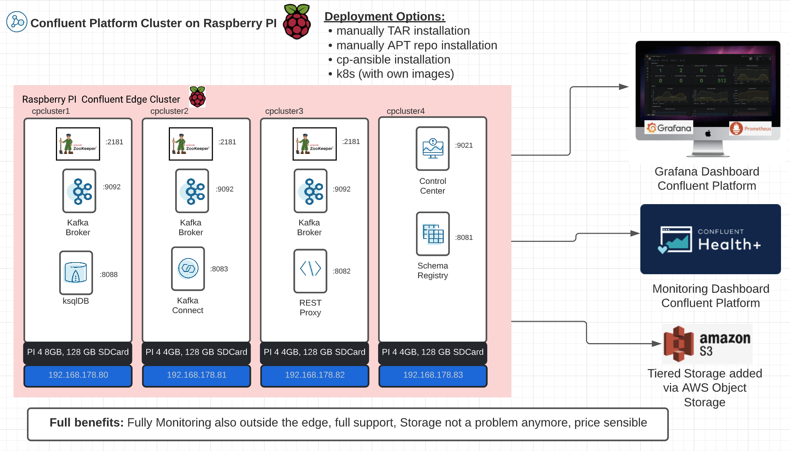

# Confluent Platform Installation on Raspberry PI via Tar Balls/Zip archive

The main goal is running a Raspberry PI 4 Node cluster with a Confluent Platform deployment.
Installation setup is shown in following image.


## Raspberry preparation for each Node
Note: Before we are starting please format with SD Formatter SDCard image

Please follow the installation and configuration process for each node:
* [cpcluster1 Node deployment](ReadmeCPCLUSTER1.md)
* [cpcluster2 Node deployment](ReadmeCPCLUSTER2.md)
* [cpcluster3 Node deployment](ReadmeCPCLUSTER3.md)
* [cpcluster4 Node deployment](ReadmeCPCLUSTER4.md)

Start cluster run `scripts/98_startup_cluster.sh`

# Performance Test mit Kakfa perftest tool
I did run the following perftest for a short check how much powner by 200€ cluster has:
```bash
# create topic
kafka-topics --bootstrap-server 192.168.178.80:9092,192.168.178.81:9092, 192.168.178.82:9092 \
		--create \
		--topic perf-test-rep-three \
		--partitions 6 \
		--replication-factor 3 \
		--command-config ./client.config

# describe topic
kafka-topics --bootstrap-server 192.168.178.80:9092,192.168.178.81:9092, 192.168.178.82:9092 \
		--describe \
		--topic perf-test-rep-three \
		--command-config ./client.config

# run perf test
kafka-producer-perf-test \
	--topic perf-test-rep-three \
	--producer.config ./client.config \
	--num-records 1000000 \
	--throughput -1 \
	--record-size 1000
```
The result is not too bad for such a small cluster:
```bash
66225 records sent, 13242.4 records/sec (12.63 MB/sec), 1576.9 ms avg latency, 2699.0 ms max latency.
54368 records sent, 10873.6 records/sec (10.37 MB/sec), 2992.5 ms avg latency, 4221.0 ms max latency.
44608 records sent, 8880.7 records/sec (8.47 MB/sec), 3270.5 ms avg latency, 4720.0 ms max latency.
65120 records sent, 13024.0 records/sec (12.42 MB/sec), 2722.8 ms avg latency, 4812.0 ms max latency.
63680 records sent, 12728.4 records/sec (12.14 MB/sec), 2658.5 ms avg latency, 4120.0 ms max latency.
55744 records sent, 11146.6 records/sec (10.63 MB/sec), 2837.7 ms avg latency, 4555.0 ms max latency.
61664 records sent, 12332.8 records/sec (11.76 MB/sec), 2769.4 ms avg latency, 4832.0 ms max latency.
47648 records sent, 9493.5 records/sec (9.05 MB/sec), 2903.3 ms avg latency, 4905.0 ms max latency.
59040 records sent, 11808.0 records/sec (11.26 MB/sec), 2625.9 ms avg latency, 4932.0 ms max latency.
```
Do the same test with a tiered storage topic where the hot data stays for 1 minute on the broker `confluent.tier.local.hotset.ms=60000` and with a retention of 30 minutes `retention.ms=1800000` :
```bash
#Create topics with hotset
kafka-topics --bootstrap-server 192.168.178.80:9092,192.168.178.81:9092, 192.168.178.82:9092   \
  --create --topic tieredstoragetopic \
  --partitions 6 \
  --replication-factor 3 \
  --config confluent.tier.enable=true \
  --config confluent.tier.local.hotset.ms=60000 \
  --config retention.ms=1800000
# run perf test
kafka-producer-perf-test \
	--topic tieredstoragetopic \
	--producer.config ./client.config \
	--num-records 1000000 \
	--throughput -1 \
	--record-size 1000
```
The result is not too bad for such a small cluster:
```bash
61345 records sent, 12259.2 records/sec (11.69 MB/sec), 1490.7 ms avg latency, 3076.0 ms max latency.
43328 records sent, 8660.4 records/sec (8.26 MB/sec), 4106.9 ms avg latency, 5456.0 ms max latency.
29248 records sent, 5607.4 records/sec (5.35 MB/sec), 2852.4 ms avg latency, 5236.0 ms max latency.
57376 records sent, 10930.8 records/sec (10.42 MB/sec), 3599.5 ms avg latency, 6623.0 ms max latency.
51008 records sent, 10201.6 records/sec (9.73 MB/sec), 3806.9 ms avg latency, 6525.0 ms max latency.
53152 records sent, 10621.9 records/sec (10.13 MB/sec), 3070.6 ms avg latency, 6523.0 ms max latency.
43072 records sent, 8611.0 records/sec (8.21 MB/sec), 3026.8 ms avg latency, 6989.0 ms max latency.
58208 records sent, 11639.3 records/sec (11.10 MB/sec), 3388.2 ms avg latency, 7147.0 ms max latency.
36416 records sent, 7280.3 records/sec (6.94 MB/sec), 3804.7 ms avg latency, 7532.0 ms max latency.  
```
The performance is more or less the same. But with tiered storage we do need much disk space on the broker.

# STOP Cluster
Stop Cluster `./99_shutdown_clustersh cpcluster1 cpcluster2 cpcluster3 cpcluster4`